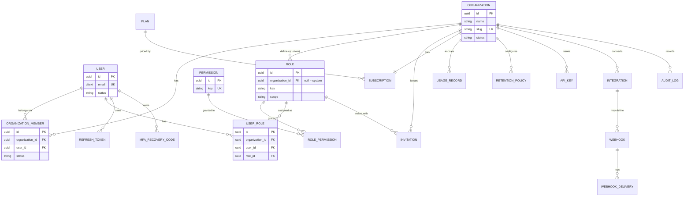
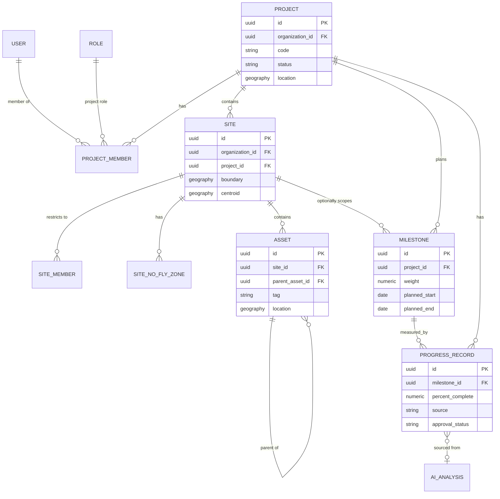
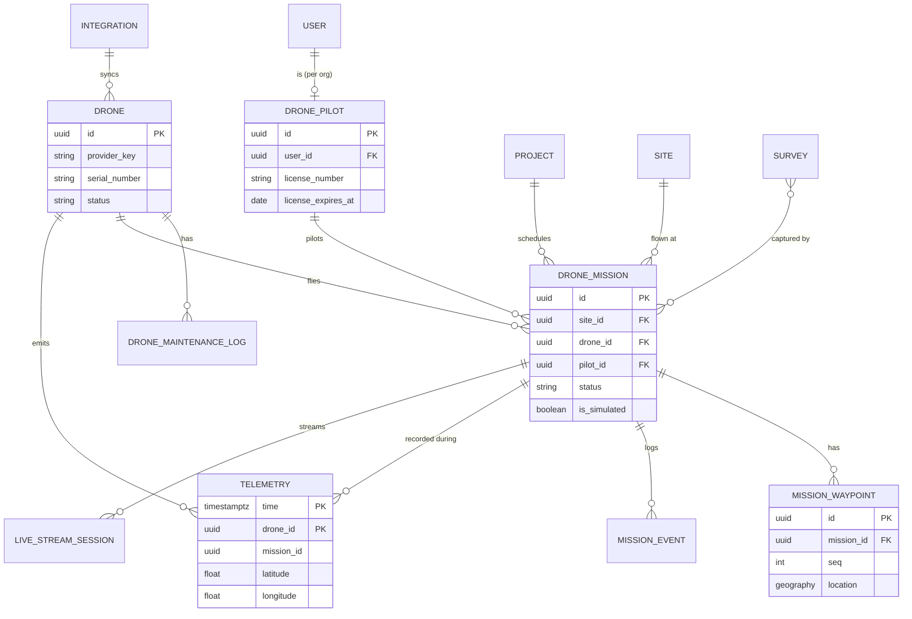
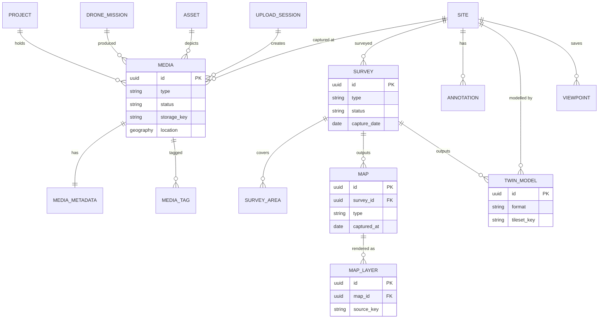
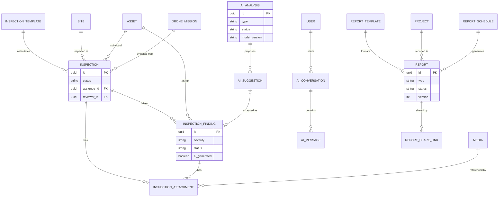
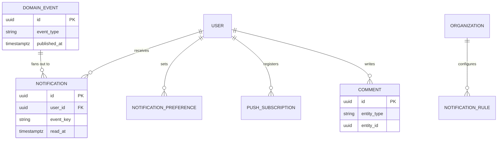

# Entity Relationship Diagram (ERD)

| | |
|---|---|
| **Document** | Entity Relationship Diagram |
| **Project** | AeroSight AI |
| **Doc ID** | ASAI-DOC-08a |
| **Version** | 0.1 |
| **Status** | Draft |
| **Author** | AeroSight AI Engineering (DBA) |
| **Reviewer** | _Pending — Tech Lead, DBA_ |
| **Created** | 2026-10-06 |
| **Last Updated** | 2026-10-06 |

### Change History
| Version | Date | Author | Change |
|---|---|---|---|
| 0.1 | 2026-10-06 | Engineering | Initial ERD (Mermaid) |

---

The ERD is split into six domain views so it stays readable. Diagrams use Mermaid (they render on GitHub, GitLab and most Markdown viewers). Column-level detail is in [Database-Design.md](Database-Design.md).

**Convention:** every entity except `ORGANIZATION`, `USER`, `PERMISSION` and `PLAN` carries `organization_id`. For readability, the `ORGANIZATION ||--o{ X` edge is drawn only in view 1.

## 1. Tenancy, Identity & Access

## 2. Projects, Sites & Assets

## 3. Fleet, Missions & Telemetry

## 4. Media, Surveys, Maps & 3D

## 5. Inspections, AI & Reports

## 6. Collaboration, Notifications & Events

## 7. Relationship Rules Summary

| Rule | Enforcement |
|---|---|
| Child rows share the parent's organization | Composite FKs `(organization_id, parent_id)` → parent `(organization_id, id)` |
| Asset hierarchy stays within one site | Trigger `assets_parent_same_site` + cycle check (recursive CTE) |
| Mission's site belongs to the mission's project | Composite FK `(organization_id, project_id, site_id)` → `sites(organization_id, project_id, id)` |
| One subscription per organization | `UNIQUE(organization_id)` on `subscriptions` |
| One pilot profile per user per org | `UNIQUE(organization_id, user_id)` on `drone_pilots` |
| One metadata row per media | `UNIQUE(media_id)` on `media_metadata` |
