# Screen & User Flow Document

| | |
|---|---|
| **Document** | Screen & User Flow Document |
| **Project** | AeroSight AI |
| **Doc ID** | ASAI-DOC-13 |
| **Version** | 0.1 |
| **Status** | Draft |
| **Author** | AeroSight AI Design |
| **Reviewer** | _Pending — Design Lead, Product Owner_ |
| **Created** | 2026-10-06 |
| **Last Updated** | 2026-10-06 |

### Change History
| Version | Date | Author | Change |
|---|---|---|---|
| 0.1 | 2026-10-06 | Design | Initial 14 core flows |

---

Flows use Mermaid flowcharts. Screen IDs (P#, A#, X#) refer to the [UX Specification](UX-Specification.md).

## F-01 Signup & onboarding (Owner)

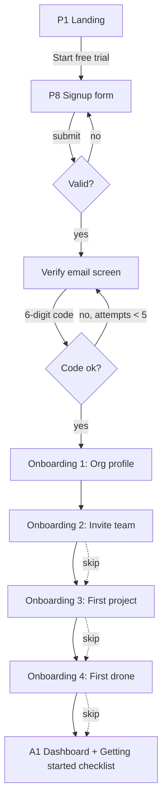

**Exit criteria:** org `active`, user is Owner, trial subscription created, audit `org.created`, `member.joined`.

## F-02 Login with 2FA & org selection

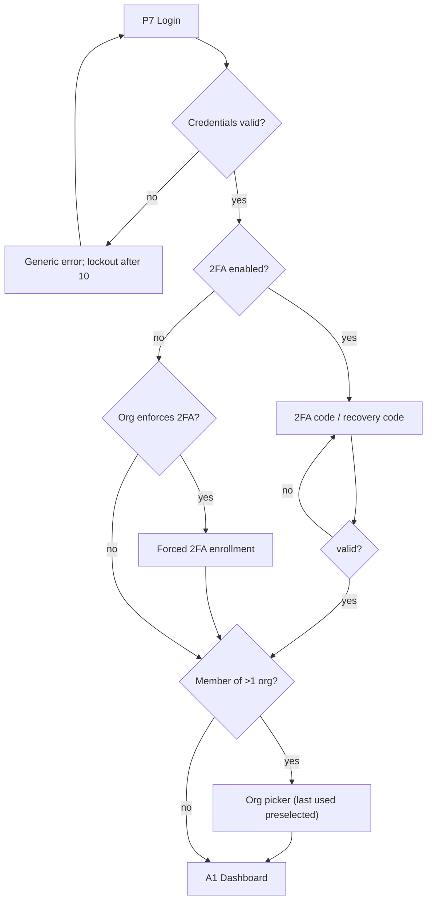

## F-03 Invite member & accept

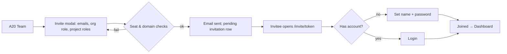

## F-04 Create project → site → assets (PM)

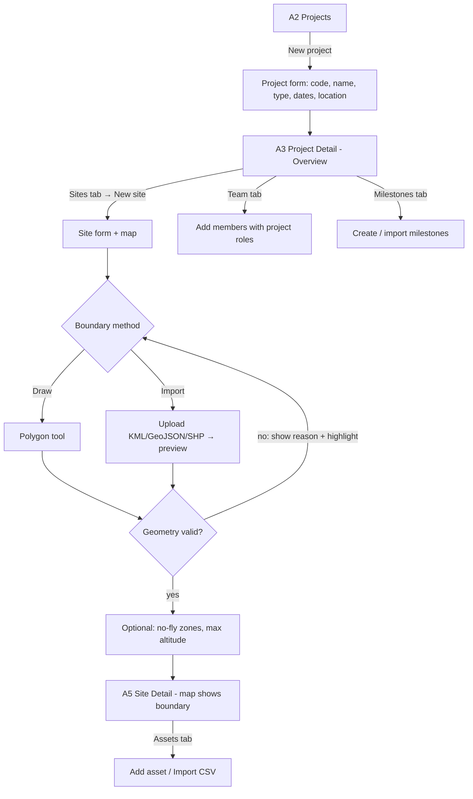

## F-05 Plan, approve and fly a mission (PM → Pilot)

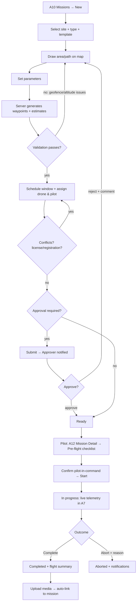

**Simulated variant:** for simulator drones, steps N–O stream simulated telemetry and all screens show the `Simulated` label.

## F-06 Upload media batch (Pilot)

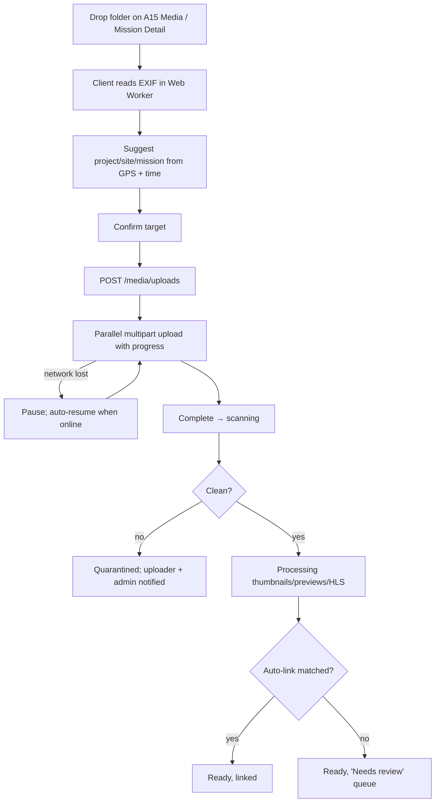

## F-07 Live operations monitoring (Site Manager)

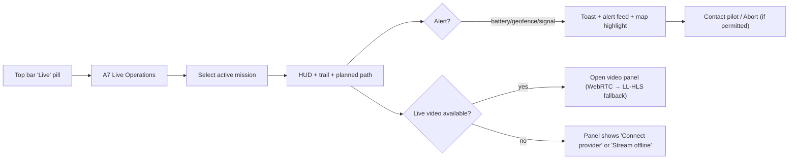

## F-08 Upload & publish a survey (Surveyor)

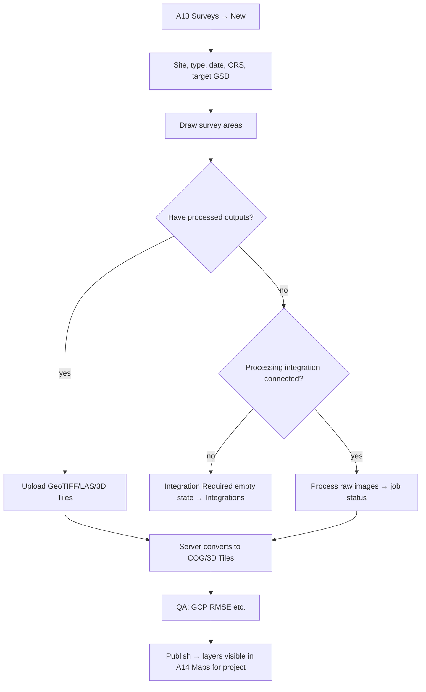

## F-09 Compare progress between dates (PM)

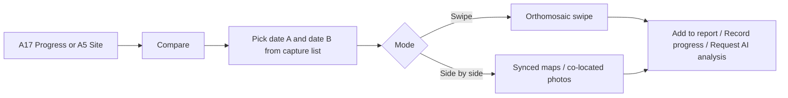

## F-10 AI progress analysis & review (PM, Phase 2)

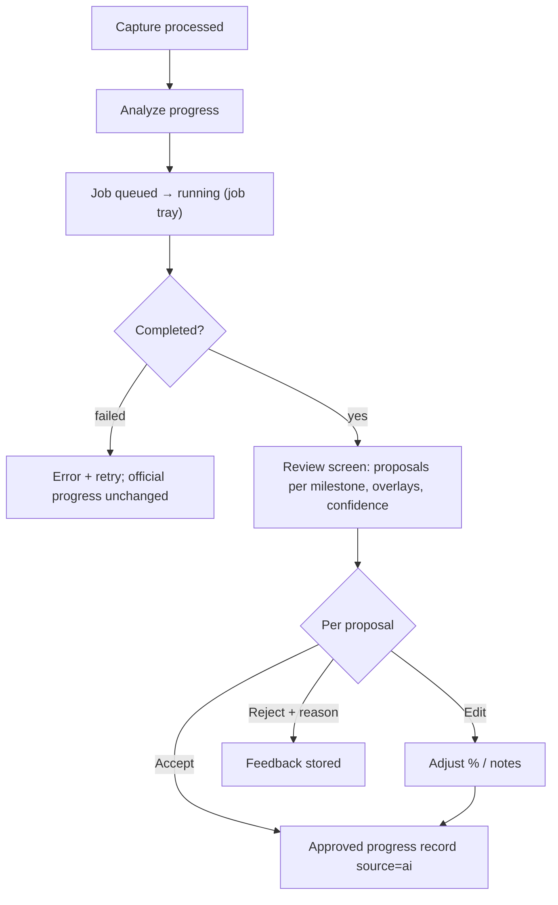

## F-11 Inspection lifecycle (Inspector → Engineer, Phase 2)

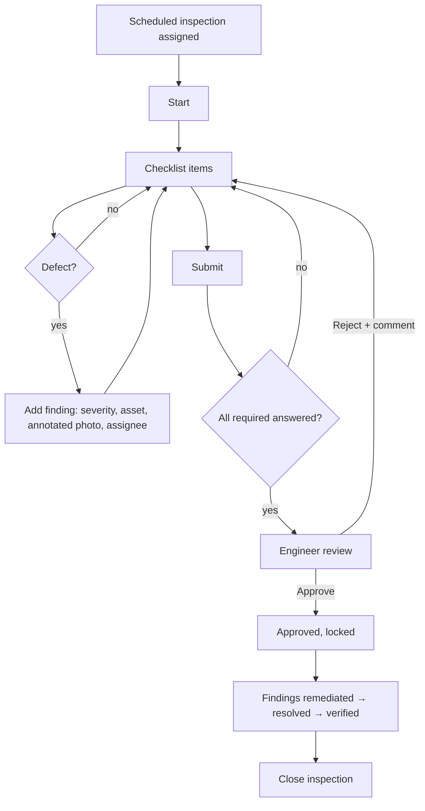

## F-12 Generate and share a report (PM)

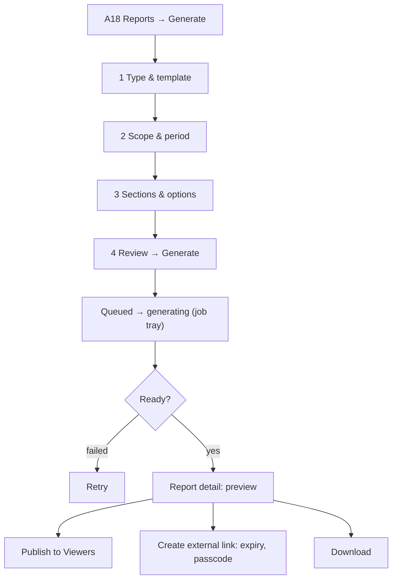

## F-13 Client viewer journey

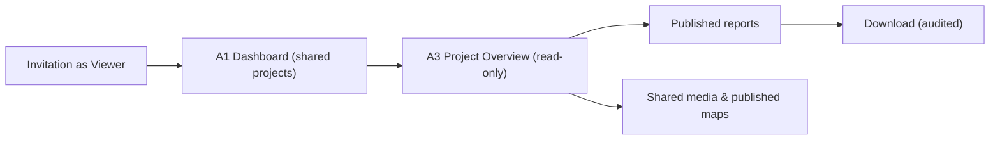

## F-14 Platform admin suspends an organization

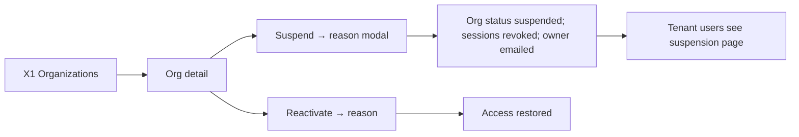

## Error & edge flows (cross-cutting)

| Situation | Flow |
|---|---|
| Session expired during work | Silent refresh. If the refresh fails → modal "Session expired" → login → return to the same URL with form drafts restored (IndexedDB). |
| Permission revoked mid-session | Next API call returns 403/404 → toast "Your access changed" → the UI refetches `/me/permissions` and navigates to the nearest accessible page. |
| Org switched in another tab | BroadcastChannel event → other tabs show "Organization changed" with reload. |
| Offline | Banner "You're offline". Reads come from cache. Writes are queued only for checklist items and comments. Other actions are disabled. |
| Plan limit reached | Inline upsell card with the specific limit and "Contact owner" for non-billing users. |
